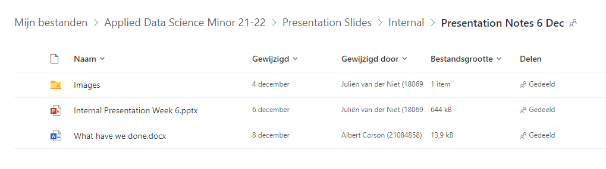
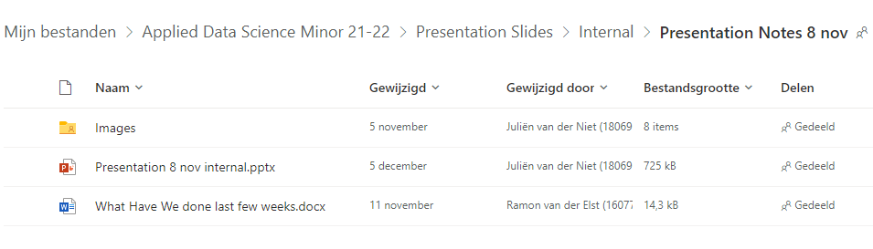

# Portfolio

**Firstname** : Juliën  
**Lastname** : van der Niet  
**Student number**: 18069681  
**Date**: 27 December 2021  
**Project group** : IMPutation  

---

# Table of Contents
- [Portfolio](#portfolio)
- [Table of Contents](#table-of-contents)
- [Mandatory requirements](#mandatory-requirements)
  - [Datacamp certificates](#datacamp-certificates)
  - [Reflection on group project contributions](#reflection-on-group-project-contributions)
    - [Personal STARR-based reflection on writing the paper <br></br>](#personal-starr-based-reflection-on-writing-the-paper-br)
  - [Reflection on own learning objectives](#reflection-on-own-learning-objectives)
    - [STARR-based reflection on learning objectives](#starr-based-reflection-on-learning-objectives)
  - [Evaluation of the group project](#evaluation-of-the-group-project)
    - [STARR-based reflection on taking more of a leadership role in the last weeks<br></br>](#starr-based-reflection-on-taking-more-of-a-leadership-role-in-the-last-weeksbr)
- [**Subject #1:** Research project](#subject-1-research-project)
  - [Conclusion of the research project](#conclusion-of-the-research-project)
  - [Further research](#further-research)
  - [Planning](#planning)
- [**Subject #2:** Domain Knowledge](#subject-2-domain-knowledge)
  - [Terminology explained](#terminology-explained)
  - [Sources used for learning about Imputation](#sources-used-for-learning-about-imputation)
- [**Subject #3:** Data Preprocessing](#subject-3-data-preprocessing)
  - [Visualizations](#visualizations)
- [**Subject #4:** Communication](#subject-4-communication)
  - [Presentations](#presentations)
  - [Writing the paper](#writing-the-paper)
- [Feedback](#feedback)
  - [Feedback from others](#feedback-from-others)
  - [Feedback for others](#feedback-for-others)

# Mandatory requirements

This chapter will cover the required criteria as stated in the evaluation rubric. The evidence to back up claims made in this portfolio will come in the form of hyperlinks to the evidence material.

## Datacamp certificates  
  
---

1. [**Introduction to Python**](https://www.datacamp.com/statement-of-accomplishment/course/0d41e08e0f2b3cc9237a598a8ac822b7c8b05860) 
2. [**Intermediate Python**](https://www.datacamp.com/statement-of-accomplishment/course/4d486123dc053ca2694097de7e6127f81316a876)
3. [**Python Data Science Toolbox (Part 1)**](https://www.datacamp.com/statement-of-accomplishment/course/0651e2ac7e9182f90b8a11e40643bea15787c5c1)
4. [**Python Data Science Toolbox (Part 2)**](https://www.datacamp.com/statement-of-accomplishment/course/4282ff9502056eae87859c5cdfe1e966240187b1)
5. [**Statistical Thinking in Python (Part 1)**](https://www.datacamp.com/statement-of-accomplishment/course/62a89048462af20d499a352afac77a6baf1b42df)
6. [**Statistical Thinking in Python (Part 2)**](https://www.datacamp.com/statement-of-accomplishment/course/d05439b77c7d468bc9a735e6db71b967b174e7db)
7. [**Supervised Learning with scikit-learn**](https://www.datacamp.com/statement-of-accomplishment/course/ef474d922c1b699daac6676f33c3dac3a044b759)
8. [**Linear Classiers in Python**](https://www.datacamp.com/statement-of-accomplishment/course/ce7ee8ac0416e06da1dc158a3e022de9d89954d5)
9. [**Introduction to Data Visualization with Matplotlib**](https://www.datacamp.com/statement-of-accomplishment/course/180fd9544eaea8b77a08b47cf27c9f6a9851d6d3)
10. [**Model Validation in Python**](https://www.datacamp.com/statement-of-accomplishment/course/d61e1e1df9b4d12b30c000d77b671337231b72ae)
11. [**Cleaning Data in Python**](https://www.datacamp.com/statement-of-accomplishment/course/d33d4326e44e7ebf3cc2030ac866dbd3a4167c34)
12. [**Data Manipulation with pandas**](https://www.datacamp.com/statement-of-accomplishment/course/4b4119271c4d139e096e13c65fa9ed8364185db5)
13. [**Exploratory Data Analysis in Python**](https://www.datacamp.com/statement-of-accomplishment/course/eba7ce278a04f06ff54a12d224ec07da44e57c74)
14. [**Manipulating Time Series Data in Python**](https://www.datacamp.com/statement-of-accomplishment/course/4408c464b2f72c80b251a7dd9283d78904d9365a)
15. [**Time Series Analysis in Python**](https://www.datacamp.com/statement-of-accomplishment/course/b2116ff973d5f0d97520a8415189bca1db44879a)
16. [**Joining Data with pandas**](/Datacamp%20Certificates%20Backup/Progress_Joining_Data_with_pandas.png)
17. [**Machine Learning for Time Series Data in Python**](/Datacamp%20Certificates%20Backup/Machine%20Learning%20for%20Time%20Sereis%20Data%20in%20Python.png)

[*Back up of certificates*](/Datacamp%20Certificates%20Backup/)

[*Back to table of contents*](#table-of-contents)
<br></br>

---

## Reflection on group project contributions  

---  

I didn't have a specific role in this project, I think I did a bit of everything during this project. For the research part of our project I worked on the research proposal and the final paper. I also added some of the imputation methods found in literature and datacamp to our projects e.g. regression and KNN. I didn't do much work on the pipeline architecture but I did add some visualizations to visualize the results.

In the month of December my focus has been writing the paper. I wrote most of the paper myself and constantly asked group members and sometimes teacher for feedback to improve the paper.

**Tasks I worked on:**

*Research:*  
- [Research proposal]()
- [Research paper]()
- [Studies read to familiarize myself with the field]()

*Communication:*
- [Internal presentation 8 November](/Presentations/Internal_November_8.pptx)
- [Internal presentation 6 December](/Presentations/Internal_Week_6.pptx)
- [Internal presentation 20 December](/Presentations/Internal_December_20.pptx)
- [Preperation External Presentations](https://www.canva.com/design/DAEvc6PSrRc/QSvuCi_b7rpERo3q_xepXA/view?utm_content=DAEvc6PSrRc&utm_campaign=designshare&utm_medium=link&utm_source=sharebutton)

*Applying reseach/imputation methods:*
- [Deterministic Regression]()
- [Stochastic Regression]()
- [KNN regression (algorithm)]()
- [Forward filling](/Project%20Notebooks/forward_fill.ipynb)
- [Time optimized interpolation](Project%20Notebooks/time_interpolation.ipynb)
- [Linear interpolation](Project%20Notebooks/linear_interpolation.ipynb)
- [MICE]()
- [Random Imputation]()
- [Imputation by mean](/Project%20Notebooks/mean_imputation.ipynb)
- [Imputation by mode](/Project%20Notebooks/mode_imputation.ipynb)
- [Imputation by median](/Project%20Notebooks/median_imputation.ipynb)  

*Visualizations:*
- [Correlation Heatmap]()
- [Missingno Matrix]()
- [Value distribution histogram]() <br></br>
  
### Personal STARR-based reflection on writing the paper <br></br>
**Situation:**  
In the month December I thought that we were further along with writing the paper than we actually were. Which created a time window of three weeks to write the paper from start to finish whilst still getting results from imputation. To constantly improve on writing feedback and questions meetings had to be planned frequently with the group and teachers.

Accompanying research for the paper was also in need of improvement to get a starting point for our paper.

**Task:**  
Write the research paper and improve on it based on feedback given. Also support material with literature.

**Action:**  
I started writing the paper on the third of december and did the required research for what I wrote. I finished a final version (before feedback) on the 31st of December and as a group we continued writing the missing parts on the 4th of January.

**Result:**  
A formal paper written to communicate our research done during this project.

**Reflection:**  
Because we started too late with writing the paper I had to spend a lot of the Christmas break working on the paper. Due to difference in writing style and other people being busy I wrote the paper myself aside from individual piece for methods and feedback. If I had to do this over again I would be more inclusive with other people writing too. Aside from this I think that I communicated clearly to my group members as to what progress I made when writing the paper.


## Reflection on own learning objectives  

---
I wanted to use this minor to get an introduction into data science so that I could get an impression if it is truly something that interests me. I had no specific learning objective in mind when starting the minor but during the minor I developed a couple of personal goals:
1. Writing and submitting an official research paper
2. Competency in Python programming
3. Using visualizations and data to draw and support sound conclusions

I have written reseach reports and essays before but never a formatted research paper. During this semester I tried to build up to a well written paper that could be accepted at an official conference. I personally enjoy the process 
of writing a paper and feedback given by teachers and Mr. Baldiri Salcedo Rahola
(our client) has given me a better idea of how to write a paper.

I had used Python before as a quick scripting language for formatting documents or quick calculations but it never got much deeper than that. Through the datacamp courses I got a way more in depth comprehension of Python programming. Utilizing Pandas to manipulate DataFrame and generating detailed visuals based on data has been a definite highlight for me as that has been something I wanted to do for some time.

Learning how to generate visualizations and make/support conclusion based on them was something that I definitely wanted to improve on during this semester. Learning about them in the lectures and datacamp courses and applying them in a group project is a skill that will be an asset for later. 
  
<br></br>    

### STARR-based reflection on learning objectives  


**Situation:**  
After the pipleline was done running and evaluating the selected imputation methods we were left with an excel file filled with performance metrics. These results needed to be properly studied to draw sound conclusions for our research paper. To support decisions made visualizations were also required to back up the conclusions.  

**Task:**  
Make sound conclusions based on data and support them with visualizations.    

**Action:**  
I created visualizations that were made to support findings in the paper. Since it was a group project we made conclusions on the metrics together.

**Result:**  
The actions taken resulted in the conclusion of the paper, I personally find that the visuals created do support our findings.

**Reflection:**  
If I had more time I would have liked to have gotten more feedback on the visualizations included in the paper.  <br></br>


## Evaluation of the group project    

--- 


Our group had people of various nationalities, which meant we had to communicate in English instead of Dutch. This was my first English project although I have written English reports before. Every group members English speaking abilities were great but it still felt hard at times to communicate specific parts of the project. Sometimes it felt in speaking and hearing that the semantics of what some was trying to say fell off which created some small inconsistencies in collaboration.

I think we all got along during this project and arguments we did have were solved in a mature manner. 


### STARR-based reflection on taking more of a leadership role in the last weeks<br></br>

**Situation:**  
During the last weeks of the project we (project group) felt a bit aimless. Some group members weren't sure of what they should do and nor were they asking. We were stuck at evaluating which made writing the results hard and meant that progress halted on writing the paper. Exchange students were also back in their home countries. 

**Task:**  
Make sure everyone has a task to do and as a group check on their work so that finishing the paper is as smooth of a process as possible.

**Action:**  
Because I was writing the paper I did have the best overview on what had to be done to complete our research. When looking at JiRa and asking what people were working on I got an idea of what people were doing and who had time to do which task. To communicate my thoughts on what needs to be done and requests to who should do what I used our Whatsapp group. To make clear of what each task entailed I messaged people individually to give a more detailed insight of what needs to be done. 

In the whatsapp group I also coordinated a couple of meeting in the latter half of the Christmas break during which we would finish the paper. Before each meeting I sent out a document containing agenda points of what needed to be done that day.

[Example of a agenda point document](/Research%20Project/Agenda_points_for_jan_4th.docx)

**Result:**  
Clearer coordination in the last few weeks which allowed us to have a better idea of what needed to be done. The result is also a better paper because we all gave feedback on each others work.

**Reflection:**  
I should have started being more assertive earlier on the project. I think it would have improved communication of what needed to be done and perhaps balanced the workload a bit more. As a group I think we should have checked up on each others work more so that the improvements in work down were more gradual. 


# **Subject #1:** Research project  

The imputation research project is a project which purpose was to create a guideline for imputing Building management(BMS) time series data. The client for this project was the research group Energy in Transistion (EiT), a research group from THUAS. EiT provided us with a dataset of BMS data of 120 houses during 2019 built by Factory Zero. During the project we had constant contact with a researcher from the group, Mr. Baldiri Salcedo Rahola.

BMS's record values at a five minute interval but due to sensor or data storage error these values can be lost. These losses can create inconsistencies down the line in applications that make use of the data generated by these BMS's an example of this forecasting which has been proven to perform worse when making use of incomplete data sets.

From preliminary research and talking to the client and teachers we quickly realized that there probably wouldn't be one method fits all solution. Which is why it was decided to form a guideline of specific methods to use in certain scenarios. This lead us to the following questions:

**Main-question:**
 - Which imputation techniques should be applied for data imputation in building energy time series data?

**Sub-questions:**
  1. What imputation methods are known for imputing time-series data?
  2. Which imputation methods are best suited for what gap sizes
  3. What imputation methods are best suited for which types of data?

From research done in the first weeks of the project we found that some methods will most likely perform better on certain dataclassifications. Gap size also seemed to matter due to some methods having a bigger bias in larger gaps.  

In the final paper our main question was answered by creating a guideline for which imputation method to use in what scenario. Sub question was not included in in the paper but was certainly used whilst researching. This research resulted in the methods evaluated in the end. 

## Conclusion of the research project

## Further research
This research project only evaluated imputation methods on known evaluation metrics and if they could follow a trend in data or not. Further research should focus on evaluating the imputation methods performance based on the impact of forecasting data with the imputed values.

Another interesting angle to building upon this paper would be creating a more generic plug 'n play model. Guidelines are a good start but making a model that says this method is the best in scenario X and applies said method automatically would be the next step.

## Planning
At the start of the project we made a verbal agreement on what to finish when. Our goal was to present the research phases during the external presentations but we deviated from that when it came into practice. During the first weeks we had meetings once or twice a week but later on we upped that to daily meetings.

For visualizing our KANBAN board we made of use of JiRA. Tasks were added weekly on Thursdays after meeting together and with teachers and at the end of each sprint we added backlog tasks for the next one. We didn't do traditional retrospectives but at the end of each sprint (which was always a Thursday) we discussed what we had done and what needed extra attention for the next sprint.
<details>
  <summary>Jira Sprint example</summary>
  

  [Sprint backup image](/Research%20Project/JiRa%20sprints/Sprint_6.png)
</details>

[***List of studies read and used during project***](/Research%20Project/Research/Studies_found_and_used_formatted.docx)  <br></br> 


# **Subject #2:** Domain Knowledge

This project was focussed on the imputation of missing time series data, specifically BMS time-series. BMS's generate a lot of data from various sensors some of its data includes: temperature, power usage, generated power and co2 level meassurements.

Power usage is an especially hard field to impute due to its volatile nature. Meaning that power usage can suddenly go up or down if someone turns on a big appliance.  

In previous literature we found that evaluating imputation was done by using the Root Mean Squared Error. In our preliminary (non-final) results we saw that the RMSE scores were quite high. On closer inspection of the data it was visible that some methods did predict trends but they were slighly later in time compared to the original.

Whilst RMSE is common use to score accuracy in imputation for our study it was less viable as the average error was not our focus. That is not to say that RMSE is a useless metric, if an imputation method doesn't follow trends it will be visible in the RMSE as well. 

For evaluation we also made use of statistics like the Skewness and Kurtosis to see how imputation impacted the distribution of the data. 

**ADD A VISUAL HERE!  Either KURTOSIS AND SKEWNESS IN NORMAL DISTRIBUTION OR HISTOGRAM OF FREQUENCY OF MEASSUREMENTS**


## Terminology explained


| Term   |      Explanation| 
|----------|:-------------:|
| Time series | text here!|
| Root Mean Squared Error (RMSE) | |
| Imputation  | |
| Kurtosis | |
| Skewness | |
| Missing At Random| |
| Missing Not At Random| |
|  | |

## Sources used for learning about Imputation

*Literature used to learn about the domain imputation:*
* [Flexible Imputation of Missing Data, Second edition by Stef van Buuren Online edition](https://stefvanbuuren.name/fimd/ch-introduction.html)

*Similar previous research:*

# **Subject #3:** Data Preprocessing

## Visualizations

# **Subject #4:** Communication

## Presentations

**Internal presentations I created and presented:**
- [**Internal presentation December 6**](/Presentations/Internal_Week_6.pptx)
- [**Internal presentation November 8**](Presentations/Internal_November_8.pptx)
- [**Internal presentation December 20**](Presentations/Internal_December_20.pptx)

**For each presentation I created the following file structure:**
```
  Presentation folder/
    Images/
      image_1.png
    Presentation file week X.pptx
    Work Description per person.docx
```

The word document was used for everyone to describe their work in the last weeks. The Images folder was used to add visuals for the powerpoint. I found this structure to be the most clear and easy to use when working on this group project.
<details>
  <summary><i>Example 1</i></summary>
  

  **Back-up:** [*Example_1*](Presentations/Structure/Example_1.png)
</details>

<details>
  <summary><i>Example 2</i></summary>
  

  **Back-up:** [*Example_2*](Presentations/Structure/Example_2.png)
</details>

**Assisted in preperation:**
- [**External presentation**](https://www.canva.com/design/DAEvc6PSrRc/QSvuCi_b7rpERo3q_xepXA/view?utm_content=DAEvc6PSrRc&utm_campaign=designshare&utm_medium=link&utm_source=sharebutton)

[*Back to table of contents*](#table-of-contents)

## Writing the paper  

---  

As stated in my learning objectives I wanted to create a paper based on our research and submit it to the CLIMA conference. I have both written the Research proposal and the final paper and asked for constant feedback on what can be improved.  

**Research Proposal:**  
To get on the same line with each other in the group and with the client and teachers a research proposal was created. During the project we deviated from some of the outlines in the proposal but I see that as only natural due to it being very early on in this minor.  

*Parts that I wrote for the research proposal:* Introduction, Research Questions, Background & context, abstract, Methodology

 

***Proof of work:***
- Research proposal document [(link)](/Research%20Project/Research%20Proposal/Research_proposal_Applied_Data_Science_project_IMP.docx)
- Editing history of the research proposal
  - [Screen shot 1 VSC](Research%20Project/Research%20Proposal/Version%20History/Version_History_October%203-14.png) , 
  [Screen shot 2 VSC](Research%20Project/Research%20Proposal/Version%20History/Version_History_September%2023_October_2.png)
- To see version history of the research proposal go to Google docs [(->link<-)](https://docs.google.com/document/d/1RehSUVk_NFjkZ0QC1pMuIAnE69TpEE6o0C73XAbNcgM/edit?usp=sharing) and go to: 
  file>version history>see version history

**Reseach paper:** 

For the paper I wrote the following: Introduction, Abstract, Methodology (Except for Hot Deck and Recurrent Neural networks), Results and Discussion. I adjusted to feedback given by teachers especially Baldiri gave a lot of feedback. He shortened my sentences by large amounts and I adapted to his feedback. 

***Proof of work:***

- Research paper document [link]()
- Google docs version of paper [link]()
- Version control screenshots: [Screen_shot_1](), [Screen_shot_2]()

**The google doc was a bit older because I switched to word as that was easier because I didn't have a stable internet connection. This means the google doc VSC doesn't have my time spent during the Christmas break. I do however have two versions in seperate files (due to sending them in for feedback). These do not display all time spent on writing the paper but do give an indication**

- [Document 1](Research%20Project/Research/Proof%20of%20work/Deprecated%20version.docx) time spent editing according to word [862 minutes](Research%20Project/Research/Proof%20of%20work/Editing%20time%20document%201.png)
- [Document 2](Research%20Project/Research/Proof%20of%20work/Version%2028-12-2021%201400%20JUL.docx) time spent editing according to word [729 minutes](Research%20Project/Research/Proof%20of%20work/Editing%20time%20document%202.png)
- [Document 3](/Research%20Project/Paper/Version%201-3-2022%2001-07%20JUL.docx)

[Back to table of contents](#table-of-contents)

<br></br>

# Feedback
As a group we forgot to make use of the 360 degree feedback tool. To make up for this I decided to ask for feedback on personal performance for this portfolio. **NOTE!:** I did get 
permission to include their feedback in this portfolio.

## Feedback from others

<details>
  <summary>Adrien Lucbert</summary>
  
</details>

<details>
  <summary>Albert Corson</summary>

  **What went well:**    

  - Willing to work  
  
  **What could be improved:**   

  - Coordination/Communication
</details>

<details>
  <summary>Jesús Martínez De Juan</summary>

  **+** Good desire to work
  **+** Some previous knowledges  
  **+** Productivity even when Julien had to quarantine  
  **-** Spending too much time in methods that didn't worked at the end (but we didn't know previously)  

  **Explanation:** I'm glad to have worked with Julien and all the members of the group. He has always good willing to work and he took the lead in taking notes of all the meetings we had so we can have the main important points clearly.
  
</details>

<details>
  <summary>Michael Weij </summary>
  
</details>

<details>
  <summary>Ramon van der Elst </summary>  
  
  **+** Very communicative and clear throughout the project.  
  **+** Took on a lot of work and with his perfectionistic approach showed some good results.  
  **-** Sometimes takes on the work alone and should try to work together more often. 

  
</details>

## Feedback for others
<details>
  <summary>Adrien Lucbert</summary>

  **+** Hardworking  
  **+** Active contributions during group only meetings or with teachers  
  **+** Enthusiastic  
  **-** Didn't ask for help  

  **Explanation:** 
  Adrien has been an absolute pleasure to work with during this semester, he was a hard worker and was one of the few people who actively contributed during meetings either internal or with teachers. At times he pulled too much work towards him, this created a bit of an uneven workload. He did his work without asking for other people to assist him in his work, which made it harder for people to assist him when needed. In the end, his enthusiastic attitude and contributions have been vital to the success of our project.

</details>

<details>
  <summary>Albert Corson</summary>

  **+** Active contributions during group only meetings or with teachers  
  **+** Hard worker  
  **-** Communication and coordination was hard at times  
  **Explanation:**
  Overall Albert has been a pleasure to work with, he was a big contributor to the project with the custom Hot Deck method and improvements to the pipeline. He was also one of the few people during meetings who would speak up and ask for clarification during meetings internal or with teachers. Coordinating was a bit hard at times but that is was mostly when working online and those problems subsided when we moved to in person when it was possible.
  
</details>

<details>
  <summary>Jesús Martínez De Juan</summary>

  **+** Adept  
  **-** Was hard to communicate and coordinate with  
  **-** Was passive during meetings  
  
  **Explanation:** To be honest I haven't worked with Jesús much because he was largely focused on Neural Networks from the start of the project. During meetings he didn't add much and needed to be asked in order to contribute.  
</details>

<details>
  <summary>Michael Weij </summary>  

  **+** Good communication  
  **+** Good attitude  
  **-** Could have helped with Research    

  **Explanation**
  Michael and I haven't worked on the same taks during the project so I can't speak to the indiviudual quality of work aside from the LaTeX format due to his work being largely collaborative. I found his attitude during the project to be sharp and his punctuality for deadlines to gives me the same feeling.

</details>

<details>
  <summary>Ramon van der Elst </summary>  

  **+** Good at presenting especially the external presentations  
  **+** Good critical feedback on paper  
  **-** Didn't ask for help  
  **-** Passive during meetings group only and with teachers

  **Explanation:** Ramon's part for this project was writing the paper and researching previous studies to make writing the paper and the research process easier. During the last month a lot had to be done on his earliest draft of the paper, due to the fact that he had never asked for feedback from us or the teachers. The research he did also didn't overlap quite well to what was required in terms of technical aspects of the paper. This was largely due to him not asking questions for technical processes that the other group members were working on. This also showed in his paper where some clear misconceptions and lack knowledge of ongoing technical processes were apparent. In the last weeks I rewrote his first version and added some papers that I found during research. His feedback has been important for the improvement of the paper and his presentation skills were also a big help to communicating the goals, processes and results of our research. 
</details>

[Back to table of contents](#table-of-contents)
